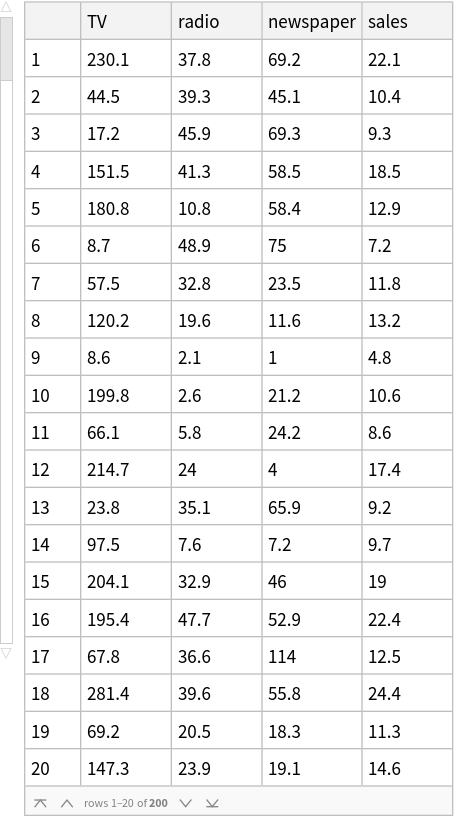
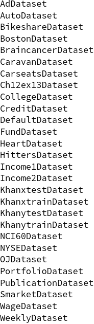

# ISLR2_Wolfram
Mathematica package for loading ISLR2 datasets 

## How to use


```Wolfram Language
Needs["ISLR2`","https://raw.githubusercontent.com/lambdaJasonYang/ISLR2_Wolfram/main/ISLR2.wl"]
```


```Wolfram Language
AdDataset // Short
```





## Available functions in the package


```Wolfram Language
Names["ISLR2`*"] // TableForm
```



